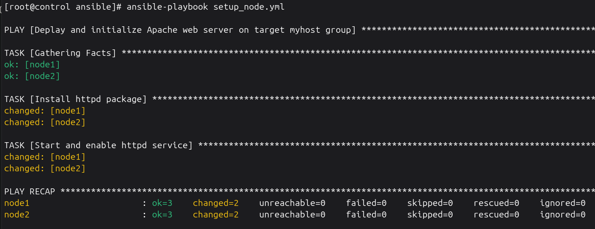
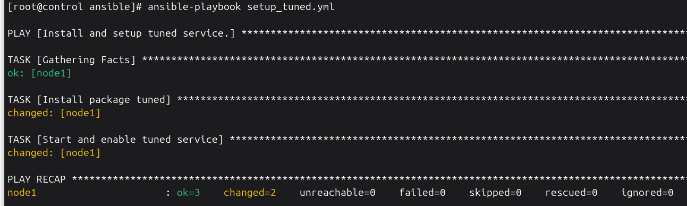
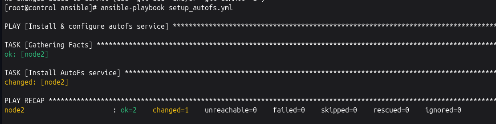
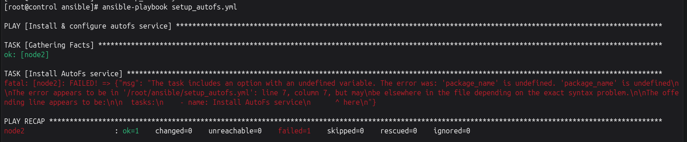

# Ansible Infrastructure Automation Lab

🚀 **Just wrapped up my first Ansible lab!**

I recently completed my **RHCSA**, and I have now started working toward my **RHCE**. This lab was my first real step into that territory — building an automation foundation completely from the ground up.

## Lab Architecture
* **Platform:** 3 KVM/virt-manager VMs running on Ubuntu.
* **Nodes:** 1 Control Node, 2 Managed Nodes.
* **Network:** Static IP addresses and dedicated hostnames configured for seamless management.

## Pre-requisite Fundamentals
Before Ansible could execute tasks, I ensured the foundational infrastructure was solid:
* 🔑 **SSH Authentication:** Key-based, fully passwordless authentication.
* 👤 **User Access:** Dedicated automation users on each managed node with proper `sudo` privileges.
* 🏷️ **Name Resolution:** Local hostname resolution configured via `/etc/hosts`.
* ⚡ **Connectivity:** Verified raw SSH connectivity from the control node to all managed nodes.

## Ansible Setup Flow
Once the foundation was ready, I configured the control node:
1. Installed Ansible and confirmed dependencies with `ansible --version`.
2. Created a dedicated project workspace directory.
3. Formatted the `inventory.ini` file and optimized settings in `ansible.cfg`.
4. Verified end-to-end orchestration using the ad-hoc command: `ansible all -m ping`.

> 💡 **The Core Takeaway:** Ansible doesn't replace sysadmin fundamentals — it depends on them completely. No amount of automation tooling fixes broken SSH authentication or missing privileges.


## Step-by-Step Installation & Lab Setup

Follow this sequence of steps to reproduce this exact lab infrastructure environment:

### 1. Network & Host Configuration (All Nodes)
Open the local hosts file across your instances to map your node hostnames directly:
```bash
sudo vi /etc/hosts
```
Add the corresponding local IP mapping layout for your specific KVM virtual environment:
```text
# Example infrastructure layout mappings
192.168.122.10   control
192.168.122.21   node1
192.168.122.22   node2
```

### 2. User & Sudo Privilege Escalation (Managed Nodes)
Log into both **node1** and **node2** to create your dedicated automation user account and provide passwordless execution privileges:
```bash
# Create the user
sudo useradd -m jon

# Set an initial account password
sudo passwd jon

# Configure passwordless sudo entry
echo "jon ALL=(ALL) NOPASSWD: ALL" | sudo tee /etc/sudoers.d/jon
```

### 3. Passwordless SSH Architecture (Control Node)
Generate your secure, dedicated cryptographic identity file on the control workstation and distribute it to your managed endpoints:
```bash
# Generate a dedicated key pair named 'ansible'
ssh-keygen -t ed25519 -f ~/.ssh/ansible -N ""

# Copy the public identification file to each host using hostname targets
ssh-copy-id -i ~/.ssh/ansible.pub jon@node1
ssh-copy-id -i ~/.ssh/ansible.pub jon@node2
```

### 4. Engine Installation & Workspace Initialization (Control Node)
Install the core runtime engine onto the control workstation, set up your project tree, and initialize configuration variables:
```bash
# Update repository lists and install Ansible core packages
sudo apt update && sudo apt install ansible -y

# Verify execution engine path and installation version
ansible --version

# Build your production workspace directory tree
mkdir -p ~/ansible && cd ~/ansible

# Initialize your engine workspace variables
touch ansible.cfg inventory.ini
```

### 5. Component Configuration & Blueprint Architecture
Populate your key configuration and targeting files with your host infrastructure parameters:

**`ansible.cfg`**
```ini
[defaults]
inventory = inventory.ini
remote_user = jon
host_key_checking = False
```

**`inventory.ini`**
```ini
# Ungrouped verification node mapping
node1

# Dynamic collection-grouped targeting architecture
[webservers]
node2
```

### 6. Orchestration Execution Verification
Trigger your deployment code via the command-line interface using an ad-hoc ping module test to check connection mapping paths:
```bash
# Execute standard infrastructure ad-hoc validation test
ansible all -m ping
```


---

## 📘 Reference: Managing Multiple Identities (Session vs. Configuration)

When handling multiple SSH keys on a control node, there are two primary management methods. Using a dedicated configuration profile file is the standard best practice for multi-key management.

### Method A: Temporary Sessions (`ssh-agent` + `ssh-add`)
```bash
eval "$(ssh-agent -s)"
ssh-add ~/.ssh/ansible
```
* **Pros:** Ideal for quick, one-off runtime tasks or working with transient infrastructure.
* **Cons:** Temporary. The memory process terminates when you close your terminal window or restart your system, forcing you to reload keys manually.

### Method B: Permanent Multi-Key Routing Matrix (`~/.ssh/config`)
```text
Host github.com
  IdentityFile ~/.ssh/ansible
  IdentitiesOnly yes
```
* **Pros:** Persistent, automated, and scales seamlessly across dozens of different infrastructure keys.
* **Cons:** Requires file creation and precise syntax parameters.

### 💡 Why `~/.ssh/config` is the Right Choice
Without a configuration routing profile, the SSH client defaults to "Key Guessing Mode"—sending every identity file listed inside `~/.ssh/` to the target host sequentially. This behavior triggers explicit security thresholds on remote hosts, leading to a `Too many authentication failures` rejection error. 

Enforcing `IdentitiesOnly yes` forces the SSH sub-system to isolate and map one explicit cryptographic identity to one matching host profile.


---

## 📖 Built-In Documentation (`ansible-doc`)

During engineering development or offline lab environments (such as the RHCE exam), use `ansible-doc` to browse parameter requirements, data types, and production examples.

### Core Documentation Shortcuts
* **View full documentation manual:**
  ```bash
  ansible-doc ansible.builtin.file
  ```
* **Extract a clean YAML code block snippet (ideal for playbooks):**
  ```bash
  ansible-doc -s ansible.builtin.user
  ```
* **List all active system modules:**
  ```bash
  ansible-doc -l
  ```

---

## 🛠️ Ad-Hoc Commands & Verification

Before moving into structured orchestration logic, you can execute individual, standalone tasks using **Ansible Ad-Hoc commands**. This is highly useful for quick operational checks, immediate provisioning changes, and real-time state verification across your managed infrastructure.

### 1. Base Connectivity Verification
Confirm end-to-end SSH connectivity, user permission mapping, and local configuration routing:
```bash
ansible all -m ansible.builtin.ping
```

### 2. Infrastructure Identity & Access Control
Manage user and security group profiles on target host filesystems:

* **Group Creation (`node1` only):**
  Create a secure user group named `sysops` on your first target environment node:
  ```bash
  ansible node1 -m ansible.builtin.group -a "name=sysops state=present" --become
  ```
* **User Account Provisioning (`node1` only):**
  Provision a new user account named `operator`, explicitly linking them to your fresh system group:
  ```bash
  ansible node1 -m ansible.builtin.user -a "name=operator group=sysops state=present" --become
  ```

### 3. Software Package Management (All Nodes)
Install foundational system tooling across your cluster nodes simultaneously:
```bash
ansible all -m ansible.builtin.apt -a "name=curl state=present update_cache=yes" --become
```
* **`update_cache=yes`**: Safely syncs local repository cache sheets prior to downloading package payloads.

### 4. Storage & Filesystem Architecture
Provision directories and initialize system files securely across your targets:

* **Directory Creation:**
  Build a dedicated configuration folder structure inside the root-level path:
  ```bash
  ansible all -m ansible.builtin.file -a "path=/etc/appdata state=directory mode=0755" --become
  ```
* **File Initialization:**
  Create an empty log tracking file with precise user profile ownership limits inside that folder:
  ```bash
  ansible all -m ansible.builtin.file -a "path=/etc/appdata/system.log state=touch mode=0644 owner=jon" --become
  ```

### 5. Service Daemon Orchestration
Control the execution state of system services across your target deployment pools:
```bash
ansible all -m ansible.builtin.service -a "name=apache2 state=started enabled=yes" --become
```
* **`state=started`**: Forces the application engine to launch immediately in system background space.
* **`enabled=yes`**: Configures the underlying bootloader to preserve system service states across future machine reboots.

---

## 🚀 Automating with Playbooks

Once the foundational ad-hoc connection infrastructure is verified, tasks can be grouped into reusable code blueprints called **Playbooks**.

### Core Playbook Blueprint (`setup_node.yml`)
This playbook connects to your target environment hosts, elevates runtime permissions using `sudo`, installs the web engine suite via the package management system, and initializes the application daemon state:

```yaml
---
- name: Deplay and initialize Apache web server on target myhost group
  hosts: myhosts
  become: true

  tasks:
    - name: Install httpd package
      ansible.builtin.dnf:
        name: httpd
        state: latest
    - name: Start and enable httpd service
      ansible.builtin.service:
        name: httpd
        state: started
        enabled: true
```

### Execution & Deployment
Run this command from your control node project workspace directory to deploy the web infrastructure across your managed nodes:
```bash
ansible-playbook setup_node.yml
```

### 📊 Verification of Execution Output
Below is the verification screenshot confirming the structured deployment playbook ran successfully against all managed infrastructure endpoints inside the KVM laboratory:



---

## 🗂️ Advanced Inventory Architecture (Parent-Child Groups)

To scale infrastructure footprints efficiently without duplicating node definitions, the inventory utilizes a **Parent-Child nested group hierarchy**.

### Hierarchical Inventory Configuration (`inventory.ini`)
The `redhat` parent group nests the existing `myhosts` and `webservers` groups under a unified tracking block:

```ini
# Base Infrastructure Group Definitions
[myhosts]
node1

[webservers]
node2

# Parent-Child Nested Architecture Group
[redhat:children]
myhosts
webservers
```

### Structural Mapping Verification
To confirm that the automation runtime engine maps the child associations correctly, execute the following visualization parsing utility:
```bash
ansible-inventory --graph
```

**Expected Structural Output Layout:**
```text
@all:
  |--@redhat:

  |  |--@myhosts:
  |  |  |--node1
  |  |--@webservers:
  |  |  |--node2
  |--@ungrouped:
```

### Design Engineering Advantage
By declaring `[redhat:children]`, you can target the entire multi-tiered cluster simultaneously in playbooks using a single call (`hosts: redhat`).


---

## ⚙️ Performance Tuning Automation (`vars`)

This playbook demonstrates the implementation of **Ansible Variables (`vars`)**. Using template variables (`{{ variable_name }}`) keeps tasks completely decoupled from hardcoded parameters, allowing for scalable configurations.

### Performance Tuning Blueprint (`setup_tuned.yml`)
```yaml
---
- name: Install and setup tuned service
  hosts: myhosts
  become: true

  vars:
    pkg_tuned: tuned
    tuned_service: tuned

  tasks:
    - name: Install and setup tuned service
      ansible.builtin.dnf:
        name: "{{ pkg_tuned }}"
        state: latest

    - name: Start and enable tuned service
      ansible.builtin.service:
        name: "{{ tuned_service }}"
        state: started
        enabled: true
```

### Execution Command
```bash
ansible-playbook setup_tuned.yml
```

### 📊 Verification of Execution Output
Below is the terminal log capture showing the variable-driven automation running successfully across target environments:




---

## 📂 Modular Architecture: External Variables (`vars_files`)

To separate automation logic from environmental configuration parameters, variables can be decoupled into isolated, external YAML sheets. This approach isolates playbook blueprints from underlying inventory-specific strings.

### 1. External Variable Mapping Space (`vars.yml`)
This flat configuration sheet holds data key-value pairs independently from any tasks:
```yaml
---
package_name: autofs
```

### 2. Implementation Playbook Blueprint (`setup_autofs.yml`)
The playbook links the external file layout via the `vars_files` directive, pointing directly to the target filesystem allocation to resolve dynamic arguments cleanly:
```yaml
---
- name: Install & configure autofs service
  hosts: webservers
  become: true
  vars_files:
    - /root/ansible/vars.yml # Loading external variables located inside project directory

  tasks:
    - name: Install AutoFs service
      ansible.builtin.dnf:
        name: "{{ package_name }}"
        state: latest
```

### Execution Baseline
```bash
ansible-playbook setup_autofs.yml
```


### 📊 Comparative Execution Output Analysis
Below is the structural comparison demonstrating the visual log difference between a standard playbook run versus an optimized, decoupled external variable file architecture:

#### Execution Flow Using External `vars_files`


#### Standard Execution Flow (Without `vars_files`)


