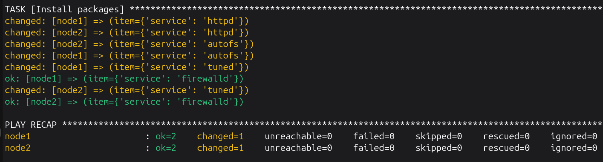
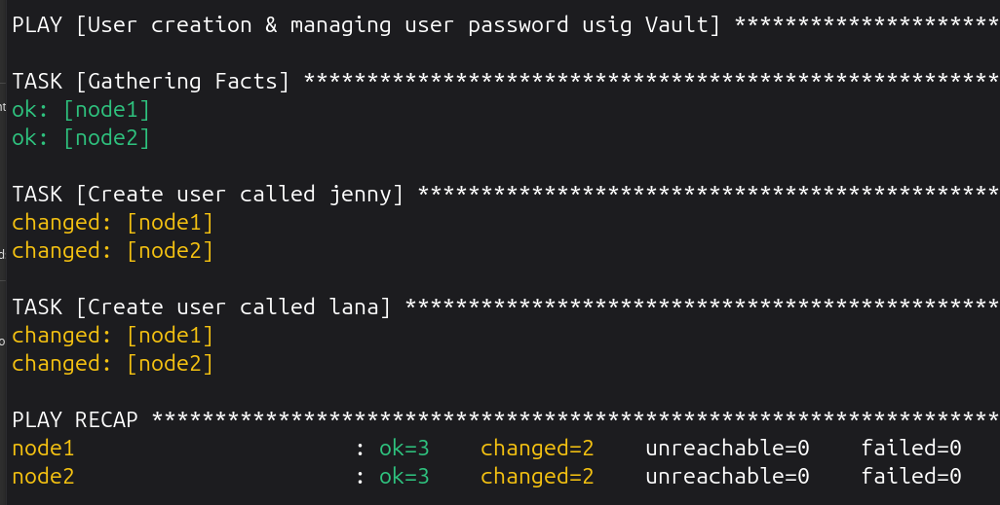
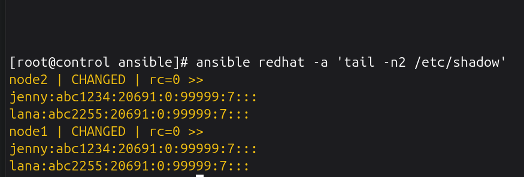
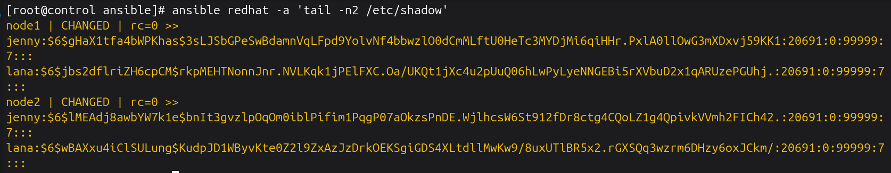
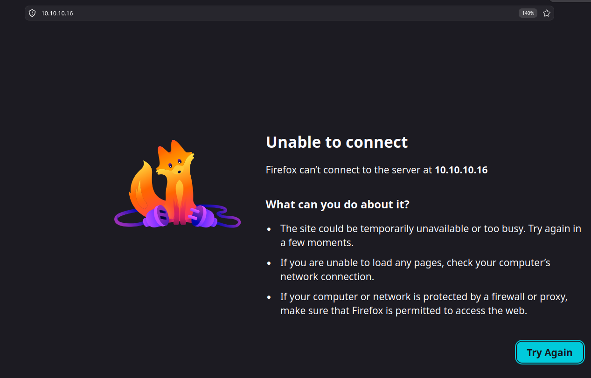
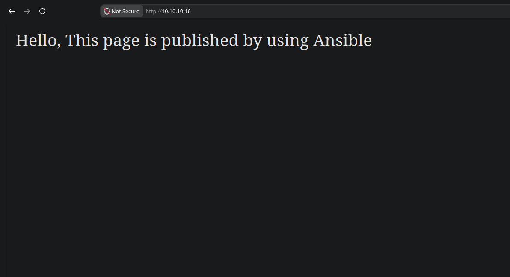

# Ansible Infrastructure Automation Lab

🚀 **Just wrapped up my first Ansible lab!**

I recently completed my **RHCSA**, and I have now started working toward my **RHCE**. This lab was my first real step into that territory — building an automation foundation completely from the ground up.

## Lab Architecture
* **Platform:** 3 KVM/virt-manager VMs running on Ubuntu.
* **Nodes:** 1 Control Node, 2 Managed Nodes.
* **Network:** Static IP addresses and dedicated hostnames configured for seamless management.

## Pre-requisite Fundamentals
Before Ansible could execute tasks, I ensured the foundational infrastructure was solid:
* 🔑 **SSH Authentication:** Key-based, fully passwordless authentication.
* 👤 **User Access:** Dedicated automation users on each managed node with proper `sudo` privileges.
* 🏷️ **Name Resolution:** Local hostname resolution configured via `/etc/hosts`.
* ⚡ **Connectivity:** Verified raw SSH connectivity from the control node to all managed nodes.

## Ansible Setup Flow
Once the foundation was ready, I configured the control node:
1. Installed Ansible and confirmed dependencies with `ansible --version`.
2. Created a dedicated project workspace directory.
3. Formatted the `inventory.ini` file and optimized settings in `ansible.cfg`.
4. Verified end-to-end orchestration using the ad-hoc command: `ansible all -m ping`.

> 💡 **The Core Takeaway:** Ansible doesn't replace sysadmin fundamentals — it depends on them completely. No amount of automation tooling fixes broken SSH authentication or missing privileges.


## Step-by-Step Installation & Lab Setup

Follow this sequence of steps to reproduce this exact lab infrastructure environment:

### 1. Network & Host Configuration (All Nodes)
Open the local hosts file across your instances to map your node hostnames directly:
```bash
sudo vi /etc/hosts
```
Add the corresponding local IP mapping layout for your specific KVM virtual environment:
```text
# Example infrastructure layout mappings
192.168.122.10   control
192.168.122.21   node1
192.168.122.22   node2
```

### 2. User & Sudo Privilege Escalation (Managed Nodes)
Log into both **node1** and **node2** to create your dedicated automation user account and provide passwordless execution privileges:
```bash
# Create the user
sudo useradd -m jon

# Set an initial account password
sudo passwd jon

# Configure passwordless sudo entry
echo "jon ALL=(ALL) NOPASSWD: ALL" | sudo tee /etc/sudoers.d/jon
```

### 3. Passwordless SSH Architecture (Control Node)
Generate your secure, dedicated cryptographic identity file on the control workstation and distribute it to your managed endpoints:
```bash
# Generate a dedicated key pair named 'ansible'
ssh-keygen -t ed25519 -f ~/.ssh/ansible -N ""

# Copy the public identification file to each host using hostname targets
ssh-copy-id -i ~/.ssh/ansible.pub jon@node1
ssh-copy-id -i ~/.ssh/ansible.pub jon@node2
```

### 4. Engine Installation & Workspace Initialization (Control Node)
Install the core runtime engine onto the control workstation, set up your project tree, and initialize configuration variables:
```bash
# Update repository lists and install Ansible core packages
sudo apt update && sudo apt install ansible -y

# Verify execution engine path and installation version
ansible --version

# Build your production workspace directory tree
mkdir -p ~/ansible && cd ~/ansible

# Initialize your engine workspace variables
touch ansible.cfg inventory.ini
```

### 5. Component Configuration & Blueprint Architecture
Populate your key configuration and targeting files with your host infrastructure parameters:

**`ansible.cfg`**
```ini
[defaults]
inventory = inventory.ini
remote_user = jon
host_key_checking = False
```

**`inventory.ini`**
```ini
# Ungrouped verification node mapping
node1

# Dynamic collection-grouped targeting architecture
[webservers]
node2
```

### 6. Orchestration Execution Verification
Trigger your deployment code via the command-line interface using an ad-hoc ping module test to check connection mapping paths:
```bash
# Execute standard infrastructure ad-hoc validation test
ansible all -m ping
```


---

## 📘 Reference: Managing Multiple Identities (Session vs. Configuration)

When handling multiple SSH keys on a control node, there are two primary management methods. Using a dedicated configuration profile file is the standard best practice for multi-key management.

### Method A: Temporary Sessions (`ssh-agent` + `ssh-add`)
```bash
eval "$(ssh-agent -s)"
ssh-add ~/.ssh/ansible
```
* **Pros:** Ideal for quick, one-off runtime tasks or working with transient infrastructure.
* **Cons:** Temporary. The memory process terminates when you close your terminal window or restart your system, forcing you to reload keys manually.

### Method B: Permanent Multi-Key Routing Matrix (`~/.ssh/config`)
```text
Host github.com
  IdentityFile ~/.ssh/ansible
  IdentitiesOnly yes
```
* **Pros:** Persistent, automated, and scales seamlessly across dozens of different infrastructure keys.
* **Cons:** Requires file creation and precise syntax parameters.

### 💡 Why `~/.ssh/config` is the Right Choice
Without a configuration routing profile, the SSH client defaults to "Key Guessing Mode"—sending every identity file listed inside `~/.ssh/` to the target host sequentially. This behavior triggers explicit security thresholds on remote hosts, leading to a `Too many authentication failures` rejection error. 

Enforcing `IdentitiesOnly yes` forces the SSH sub-system to isolate and map one explicit cryptographic identity to one matching host profile.


---

## 📖 Built-In Documentation (`ansible-doc`)

During engineering development or offline lab environments (such as the RHCE exam), use `ansible-doc` to browse parameter requirements, data types, and production examples.

### Core Documentation Shortcuts
* **View full documentation manual:**
  ```bash
  ansible-doc ansible.builtin.file
  ```
* **Extract a clean YAML code block snippet (ideal for playbooks):**
  ```bash
  ansible-doc -s ansible.builtin.user
  ```
* **List all active system modules:**
  ```bash
  ansible-doc -l
  ```

---

## 🛠️ Ad-Hoc Commands & Verification

Before moving into structured orchestration logic, you can execute individual, standalone tasks using **Ansible Ad-Hoc commands**. This is highly useful for quick operational checks, immediate provisioning changes, and real-time state verification across your managed infrastructure.

### 1. Base Connectivity Verification
Confirm end-to-end SSH connectivity, user permission mapping, and local configuration routing:
```bash
ansible all -m ansible.builtin.ping
```

### 2. Infrastructure Identity & Access Control
Manage user and security group profiles on target host filesystems:

* **Group Creation (`node1` only):**
  Create a secure user group named `sysops` on your first target environment node:
  ```bash
  ansible node1 -m ansible.builtin.group -a "name=sysops state=present" --become
  ```
* **User Account Provisioning (`node1` only):**
  Provision a new user account named `operator`, explicitly linking them to your fresh system group:
  ```bash
  ansible node1 -m ansible.builtin.user -a "name=operator group=sysops state=present" --become
  ```

### 3. Software Package Management (All Nodes)
Install foundational system tooling across your cluster nodes simultaneously:
```bash
ansible all -m ansible.builtin.apt -a "name=curl state=present update_cache=yes" --become
```
* **`update_cache=yes`**: Safely syncs local repository cache sheets prior to downloading package payloads.

### 4. Storage & Filesystem Architecture
Provision directories and initialize system files securely across your targets:

* **Directory Creation:**
  Build a dedicated configuration folder structure inside the root-level path:
  ```bash
  ansible all -m ansible.builtin.file -a "path=/etc/appdata state=directory mode=0755" --become
  ```
* **File Initialization:**
  Create an empty log tracking file with precise user profile ownership limits inside that folder:
  ```bash
  ansible all -m ansible.builtin.file -a "path=/etc/appdata/system.log state=touch mode=0644 owner=jon" --become
  ```

### 5. Service Daemon Orchestration
Control the execution state of system services across your target deployment pools:
```bash
ansible all -m ansible.builtin.service -a "name=apache2 state=started enabled=yes" --become
```
* **`state=started`**: Forces the application engine to launch immediately in system background space.
* **`enabled=yes`**: Configures the underlying bootloader to preserve system service states across future machine reboots.

---

## 🚀 Automating with Playbooks

Once the foundational ad-hoc connection infrastructure is verified, tasks can be grouped into reusable code blueprints called **Playbooks**.

### Core Playbook Blueprint (`setup_node.yml`)
This playbook connects to your target environment hosts, elevates runtime permissions using `sudo`, installs the web engine suite via the package management system, and initializes the application daemon state:

```yaml
---
- name: Deplay and initialize Apache web server on target myhost group
  hosts: myhosts
  become: true

  tasks:
    - name: Install httpd package
      ansible.builtin.dnf:
        name: httpd
        state: latest
    - name: Start and enable httpd service
      ansible.builtin.service:
        name: httpd
        state: started
        enabled: true
```

### Execution & Deployment
Run this command from your control node project workspace directory to deploy the web infrastructure across your managed nodes:
```bash
ansible-playbook setup_node.yml
```

### 📊 Verification of Execution Output
Below is the verification screenshot confirming the structured deployment playbook ran successfully against all managed infrastructure endpoints inside the KVM laboratory:


---

## 🗂️ Advanced Inventory Architecture (Parent-Child Groups)

To scale infrastructure footprints efficiently without duplicating node definitions, the inventory utilizes a **Parent-Child nested group hierarchy**.

### Hierarchical Inventory Configuration (`inventory.ini`)
The `redhat` parent group nests the existing `myhosts` and `webservers` groups under a unified tracking block:

```ini
# Base Infrastructure Group Definitions
[myhosts]
node1

[webservers]
node2

# Parent-Child Nested Architecture Group
[redhat:children]
myhosts
webservers
```

### Structural Mapping Verification
To confirm that the automation runtime engine maps the child associations correctly, execute the following visualization parsing utility:
```bash
ansible-inventory --graph
```

**Expected Structural Output Layout:**
```text
@all:
  |--@redhat:

  |  |--@myhosts:
  |  |  |--node1
  |  |--@webservers:
  |  |  |--node2
  |--@ungrouped:
```

### Design Engineering Advantage
By declaring `[redhat:children]`, you can target the entire multi-tiered cluster simultaneously in playbooks using a single call (`hosts: redhat`).


---

## ⚙️ Performance Tuning Automation (`vars`)

This playbook demonstrates the implementation of **Ansible Variables (`vars`)**. Using template variables (`{{ variable_name }}`) keeps tasks completely decoupled from hardcoded parameters, allowing for scalable configurations.

### Performance Tuning Blueprint (`setup_tuned.yml`)
```yaml
---
- name: Install and setup tuned service
  hosts: myhosts
  become: true

  vars:
    pkg_tuned: tuned
    tuned_service: tuned

  tasks:
    - name: Install and setup tuned service
      ansible.builtin.dnf:
        name: "{{ pkg_tuned }}"
        state: latest

    - name: Start and enable tuned service
      ansible.builtin.service:
        name: "{{ tuned_service }}"
        state: started
        enabled: true
```

### Execution Command
```bash
ansible-playbook setup_tuned.yml
```

### 📊 Verification of Execution Output
Below is the terminal log capture showing the variable-driven automation running successfully across target environments:


---

## 📂 Modular Architecture: External Variables (`vars_files`)

### 1. External Variable File (`vars.yml`)
```yaml
---
package_name: autofs
```

### 2. Implementation Playbook (`setup_autofs.yml`)
```yaml
---
- name: Install & configure autofs service
  hosts: webservers
  become: true
  vars_files:
    - /root/ansible/vars.yml

  tasks:
    - name: Install AutoFs service
      ansible.builtin.dnf:
        name: "{{ package_name }}"
        state: latest
```

### Execution Baseline
```bash
ansible-playbook setup_autofs.yml
```
#### ⚠️ Undefined Variable Failure Reference


---

## 🔁 Loop Architectures (`loop` + `vars_files`)

To manage complex software baselines efficiently, this playbook decouples the target application payload into a dictionary array stored inside an external variables file, processing the matrix using an **Ansible Loop**.

### 1. External Package Matrix Definition (`vars_pkg.yml`)
The structured list isolates package definitions cleanly from the task framework:
```yaml
---
packages:
  - service: httpd
  - service: autofs
  - service: tuned
  - service: firewalld
```

### 2. Implementation Loop Playbook (`loop.yml`)
The engine dynamically iterates through the data map using the `item.service` variable evaluation engine to provision all software baselines concurrently across the `redhat` parent group:
```yaml
---
- name: Installing service packages using loop
  hosts: redhat
  become: true
  vars_files: /root/ansible/vars_pkg.yml

  tasks:
    - name: Install packages
      ansible.builtin.dnf:
        name: "{{ item.service }}"
        state: present
      loop: "{{ packages }}"
```

### Execution Baseline
```bash
ansible-playbook loop.yml
```
### 📊 Verification of Loop Execution Output
Below is the terminal log capture showing the loop automation processing the variable list concurrently across all target infrastructure endpoints:



---

## 🔁 Advanced Loop Architectures (`loop` + `vars_files`)

To manage complex software baselines efficiently, this playbook decouples the target application payload into an inline compact matrix array stored inside an external variables file, processing the matrix using an **Ansible Loop**.

### 1. External variables holding file (`vars_pkg.yml`)
This flat configuration sheet holds inline data maps independently from any tasks, allowing you to explicitly dictate separate software states (such as installing, upgrading, or removing) in a single block:
```yaml
---
packages:
  - { service: 'httpd', state: 'present' }
  - { service: 'autofs', state: 'latest' }
  - { service: 'tuned', state: 'absent' }
  - { service: 'firewalld', state: 'present' }
```

### 2. Implementation Loop Playbook (`loop.yml`)
The orchestration engine parses through the inline dictionaries using the `item.service` and `item.state` data keys concurrently:
```yaml
---
- name: Installing service packages using dynamic loop
  hosts: redhat
  become: true
  vars_files: /root/ansible/vars_pkg.yml

  tasks:
    - name: Install packages
      ansible.builtin.dnf:
         name: "{{ item.service }}"
         state: "{{ item.state }}"
      loop: "{{ packages }}"
```

### Execution Baseline
```bash
ansible-playbook loop.yml
```

---

## 🔐 Managing Passwords with Ansible Vault

This section shows how to create users and keep their passwords safe using an encrypted file.

### Step-by-Step Vault Setup

1. **Create the encrypted password file:**
   Run this command to create a new secure file named `user_passwd.yml`. It will ask you to type a vault master password:
   ```bash
   ansible-vault create user_passwd.yml
   ```

2. **Add your secret variables inside the file:**
   Inside the encrypted file, type your password variables using this exact layout:
   ```yaml
   ---
   user1_passwd: "your_password_for_jenny"
   user2_passwd: "your_password_for_lana"
   ```

3. **How to edit the passwords later (Optional):**
   If you ever need to change these passwords, use this command to decrypt, edit, and re-lock the file automatically:
   ```bash
   ansible-vault edit user_passwd.yml
   ```

### Playbook Blueprint (`user_add.yml`)
The playbook automatically unlocks the encrypted file at runtime and changes the passwords into secure hashes so they work safely on Linux systems.

```yaml
---
- name: User creation & managing user password usig Vault
  hosts: redhat
  become: true
  vars_files:
    - /root/ansible/user_passwd.yml

  tasks:
    - name: Create user called jenny
      user:
        name: jenny
        state: present
        password: "{{ user1_passwd | password_hash('sha512') }}"

    - name: Create user called lana
      user:
        name: lana
        state: present
        password: "{{ user2_passwd | password_hash('sha512')}}"
```

### How to Run the Playbook

You can run this playbook using two different methods to decrypt your password file:

#### Method 1: Using an Interactive Password Prompt
This method stops and asks you to type your vault password manually in the terminal before running:
```bash
ansible-playbook user_add.yml --ask-vault-pass
```

#### Method 2: Using an Automated Password File (`pass.txt`)
This method reads the password automatically from your text file so you do not have to type anything:
```bash
ansible-playbook user_add.yml --vault-password-file pass.txt
```

---

### 📊 Verification of Encrypted User Provisioning Output
Below is the terminal log capture showing the playbook decrypting the secret values and running successfully against both infrastructure endpoints:



---

### 🔐 Filesystem Security Verification (`/etc/shadow` Analysis)
To confirm that the automation runtime engine handles secret payloads safely without leaking structural credentials to administrative logs, we inspect the `/etc/shadow` access authorization files across managed nodes:

#### Insecure Baseline (Before Applying Hash Filter)
⚠️ **Security Risk:** Without an explicit hashing algorithm filter, the plain string key payload is written directly into system storage files in cleartext format, rendering system credentials vulnerable to local privilege escalation discovery:


#### Secure Baseline (After Applying `password_hash('sha512')`)
✅ **Production Compliant:** Filtering the dynamic vault variables through the SHA-512 processor ensures that the system compiles a standard cryptographically salted shadow ledger entry (identifiable by the secure `$6$` SHA-512 designation prefix flag):


---

---

## 🌐 Publishing Web Content and Managing Firewalls

This section shows how to automatically install a web server, publish HTML content, and configure firewall rules so the web page can be accessed over the network.

### The Problem Encountered
When first running the playbook without firewall rules, the web server installed correctly and the content was placed on the server, but the web page **would not load** in a browser. This happened because the system firewall was blocking incoming HTTP network traffic. 

Adding a dedicated firewall task to allow the `http` service resolved the issue completely.

### Web Deployment Playbook (`web.yml`)
This is the exact playbook used to deploy the web server and open the required network ports:
```yaml
- name: Publish Web Content using Httpd
  hosts: node1
  become: true

  tasks:
    - name: Installing Httpd package
      yum:
        name: httpd
        state: latest

    - name: Start & enable httpd service
      service:
        name: httpd
        state: started
        enabled: true

    - name: Adding web content
      copy:
        content: 'Hello, This page is published by using Ansible'
        dest: /var/www/html/index.html

    - name: Restart the httpd service
      service:
        name: httpd
        state: restarted

    - name: Allow http through the firewall
      firewalld:
        service: http
        immediate: yes # reload firewall
        permanent: true
        state: enabled
```

### How to Run the Playbook
Run this command from your workspace terminal to execute the deployment:
```bash
ansible-playbook web.yml
```

---

### 📊 Verification and Web Access Troubleshooting

Below is the visual verification showing the network connection behavior before and after opening the firewall rules:

#### Connection Failure (Before Firewall Rule)
When trying to load the website initially, the connection timed out because the traffic could not pass through the firewall:


#### Connection Success (After Firewall Rule)
Once the `firewalld` task opened the `http` service, the web page loaded perfectly across the network:



---

## 📦 Manual Installation of Offline Ansible Collections

This section shows how to manually download, transfer, configure, and install an offline Ansible Collection from the Ansible Galaxy ecosystem into a custom project directory.

### Project Context & Use Case
The default configuration required a specialized module named `firewalld` to control system security rules. This module is packaged inside the **`ansible.posix`** collection space alongside 13 other administration modules.

### Step-by-Step Installation Workflow

1. **Download the Collection Archive Asset:**
   Navigate to the official portal (`https://galaxy.ansible.com/ui/`), locate the **`ansible.posix`** namespace page under the Collections repository segment, and download the standalone compressed archive source file to your workstation desktop machine:
   * **Target File Asset:** `ansible-posix-2.2.2.tar.gz`

2. **Transfer the Archive Asset over SFTP(not a mandatory step):** 
   Execute a file transfer from your local workstation terminal to pull the downloaded archive asset cleanly over your custom network port directly into your active control node laboratory project workspace directory:
   ```bash
   sftp user@ip_address
   # Inside the sftp prompt, run:
   get /home/user/Downloads/ansible-posix-2.2.2.tar.gz //root/ansible/
   ```

3. **Initialize a Dedicated Storage Path:**
   Build an isolated configuration folder structure inside your project workspace root to store third-party collection content dependencies independently from default global system directories:
   ```bash
   mkdir mycollections
   ```

4. **Configure Local Isolation Parameters (`ansible.cfg`):**
   Open your local project configuration layout file and add the `collections_path` string pointer direction line to force the execution engine to search your new directory space for community modules first:
   ```ini
   [defaults]
   collections_path = ./mycollections
   ```

5. **Deploy the Offline Collection Framework Archive:**
   Run the native deployment tracking utility to extract and register the workspace library framework straight into your target path mapping space:
   ```bash
   ansible-galaxy collection install ansible-posix-2.2.2.tar.gz -p mycollections/
   ```

### Operational Verification
Once the extraction completes successfully, the underlying collection frameworks and all 14 embedded administrative modules (including `firewalld`) are fully registered and ready to execute across your cluster targets without requiring a live external internet connection.


### 🔍 Useful Collection Commands

Use these commands on your control node terminal to manage, list, and verify your locally installed collection frameworks:

* **List all installed collections:**
  See a clean list of every collection available to your project, along with its exact version number and where it is stored on your disk:
  ```bash
  ansible-galaxy collection list
  ```

* **Verify collection details and version numbers:**
  Confirm that your custom path mapping is working and that `ansible.posix` version `2.2.2` is recognized by the engine:
  ```bash
  ansible-galaxy collection list -p mycollections
  ```

* **Browse module documentation offline (`ansible-doc`):**
  Look up the required parameters, options, and syntax examples for your newly installed `firewalld` module without needing an internet connection:
  ```bash
  ansible-doc ansible.posix.firewalld
  ```
* **Verify active configuration path values (`ansible-config dump`):**
  Dump the runtime configuration parameters out of system memory and filter for your specific collection keys. This confirms that the engine is actively reading your local configuration file changes:
  ```bash
  ansible-config dump | grep COLLECTIONS_PATHS
  ```
  **Expected Output String Result:**
  ```text
  COLLECTIONS_PATHS(/root/ansible/ansible.cfg) = ['/root/ansible/mycollections']
  ```
---

### ⚠️ Troubleshooting: Resolving Collection Version Warnings

When running the playbook, this warning message appeared because version `2.2.2` of the collection is too new for **Ansible version 2.14.18**:

```text
\$ ansible-playbook web.yml 
[WARNING]: Collection ansible.posix does not support Ansible version 2.14.18
```

To fix this, you must downgrade to the compatible **version 1.5.4** using one of these two methods:

#### Method 1: The Online Method (Requires Internet Access)
If your machine has a live internet connection, force the downgrade directly from the Ansible Galaxy servers:
```bash
ansible-galaxy collection install ansible.posix:==1.5.4 --force
```

#### Method 2: The Offline Method
If your control node is offline, download the file on your workstation, copy it over, and force-install the local archive payload:
```bash

# 2. Force install the archive locally on your control node terminal
ansible-galaxy collection install ansible-posix-1.5.4.tar.gz -p mycollections --force
```

---

## ⚡ Optimizing Restarts with Ansible Handlers

This section shows how to use **Ansible Handlers** to manage service restarts efficiently.

### Why Use Handlers?
In the earlier version of the web playbook, a manual restart task ran every single time the playbook executed—even if the web content never changed. This is inefficient for production systems. 

By adding a `notify` directive to the web content task and linking it to a `handlers` block, the Apache service now **only restarts if the index.html file content is modified**. If the file remains unchanged, the restart is skipped, keeping the deployment fast and clean.

### Updated Playbook with Handlers (`web.yml`)
```yaml
- name: Publish Web Content using Httpd
  hosts: node1
  become: true

  tasks:
    - name: Installing Httpd package
      yum:
        name: httpd
        state: latest

    - name: Start & enable httpd service
      service:
        name: httpd
        state: started
        enabled: true

    - name: Adding web content
      copy:
        content: 'Hello, This page is published by using Ansible'
        dest: /var/www/html/index.html
      notify: Restart Apache Service

    - name: Allow http through the firewall
      firewalld:
        service: http
        immediate: yes
        permanent: true
        state: enabled

  handlers:
    - name: Restart Apache Service
      service:
        name: httpd
        state: restarted
```

### Execution Baseline
```bash
ansible-playbook web.yml
```

